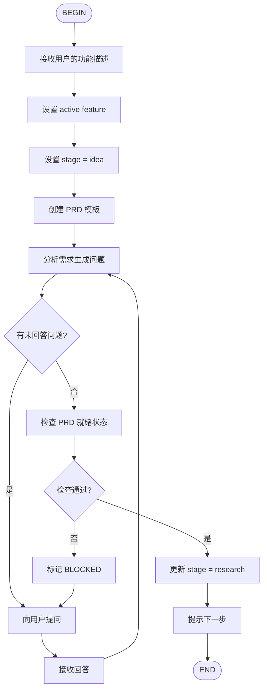

# AIDD Idea Flow

创建功能的 PRD（Product Requirements Document）草案。



## 输入

用户提供：
- Ticket ID（如 `FUNC-123`）
- 功能描述（如 "实现购物车优惠券功能"）

## 输出

生成的工件：
- `aidd/docs/prd/{ticket}.prd.md` - PRD 文档
- `aidd/docs/.active.json` - 更新活动状态

## 问题格式

向用户提问时使用标准格式：

```
Question N (Blocker|Clarification): ...
Why: ...
Options: A) ... B) ...
Default: ...
```

用户回答格式：
```markdown
## AIDD:ANSWERS
- Answer 1: ...
- Answer 2: ...
```

## 下一步

Flow 结束后，提示用户：
```
PRD 草案已创建。下一步执行：/flow:aidd-research {ticket}
```
