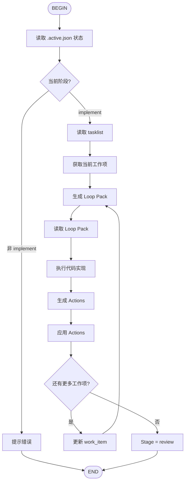

# AIDD Implement Flow

迭代实现功能的代码。



## Loop Pack 阅读顺序

1. `aidd/reports/loops/{ticket}/{scope_key}.loop.pack.md`
2. `aidd/docs/tasklist/{ticket}.md`
3. `aidd/reports/research/{ticket}-rlm.pack.json`

## Actions 系统

实现完成后生成 Actions JSON：

```json
{
  "actions": [
    {
      "type": "tasklist_ops.set_iteration_done",
      "params": {"item_id": "I1", "kind": "iteration"}
    },
    {
      "type": "tasklist_ops.append_progress_log",
      "params": {
        "date": "2026-02-12",
        "source": "implement",
        "item_id": "I1",
        "kind": "iteration",
        "hash": "abc123",
        "msg": "完成支付模块重构"
      }
    }
  ]
}
```

应用 Actions：
```bash
python3 $KIMI_AIDD_ROOT/runtime/skills/aidd-docio/runtime/actions_apply.py \
  --actions aidd/reports/actions/{ticket}/{scope_key}/implement.actions.json
```

## Loop 纪律

- 每次只完成一个工作项
- 不扩展 scope（新需求 → AIDD:OUT_OF_SCOPE_BACKLOG）
- 不提问（有问题 → handoff）
- 测试遵循阶段策略（implement 阶段不运行测试）
