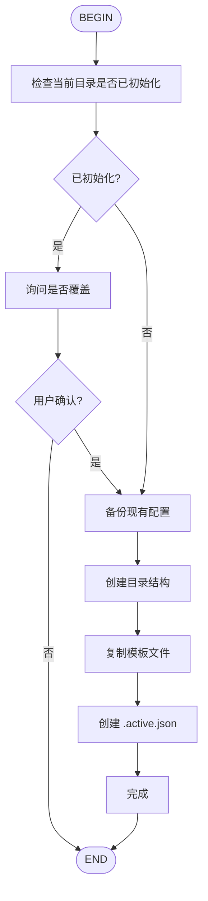

# AIDD Init Flow

初始化 AIDD 工作区。



## 创建的目录结构

```
aidd/
├── AGENTS.md
├── config/
│   ├── gates.json
│   ├── conventions.json
│   └── context_gc.json
├── docs/
│   ├── .active.json
│   ├── prd/
│   ├── plan/
│   ├── research/
│   ├── tasklist/
│   └── spec/
└── reports/
    ├── actions/
    ├── context/
    ├── loops/
    ├── qa/
    ├── research/
    ├── reviewer/
    └── tests/
```

## 使用方法

用户执行：
```
/aidd-init-flow
```

或者带参数强制覆盖：
```
/aidd-init-flow --force
```

## 初始化后

提示用户：
```
AIDD 工作区已初始化！

下一步：
1. 创建新功能：/skill:idea-new TICKET-001 "功能描述"
2. 或查看文档：cat aidd/AGENTS.md
```
