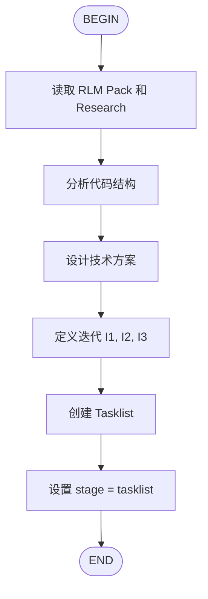

# AIDD Plan Flow

制定功能的实施计划。



## 输入

- `aidd/reports/research/{ticket}-rlm.pack.json` - RLM 研究证据
- `aidd/docs/research/{ticket}.md` - 研究报告
- `aidd/docs/prd/{ticket}.prd.md` - PRD 文档

## 输出

- `aidd/docs/plan/{ticket}.md` - 实施计划
- `aidd/docs/tasklist/{ticket}.md` - 任务清单

## 下一步

```
计划已制定。下一步执行：/flow:aidd-implement-flow {ticket}
```
