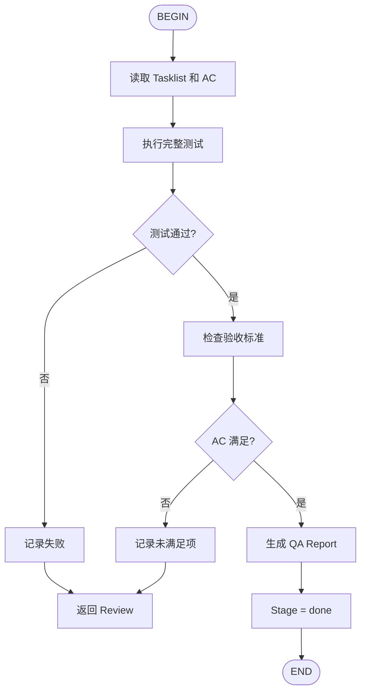

# AIDD QA Flow

执行最终质量检查和验收。



## 输入

- `aidd/docs/tasklist/{ticket}.md` - 任务清单
- `aidd/docs/prd/{ticket}.prd.md#AIDD:ACCEPTANCE` - 验收标准

## 输出

- `aidd/reports/qa/{ticket}.json` - QA 报告

## 测试策略

- QA 阶段运行完整测试套件
- 对比 AIDD:ACCEPTANCE 检查完成情况

## 完成

```
QA 通过！功能开发完成。
```
