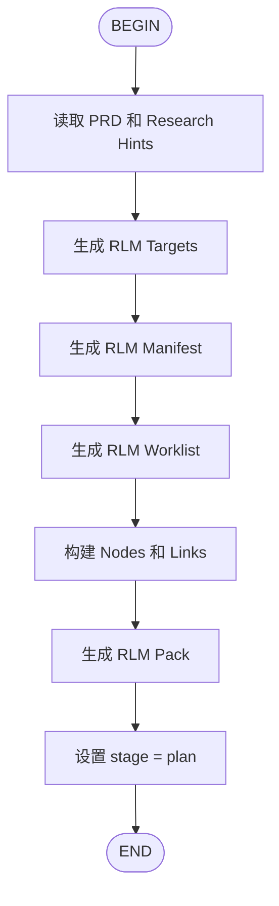

# AIDD Research Flow

研究代码库结构，生成 RLM (Research Link Model)。



## 输入

- `aidd/docs/prd/{ticket}.prd.md` - PRD 文档
- `aidd/docs/prd/{ticket}.prd.md#AIDD:RESEARCH_HINTS` - 研究提示

## 输出

- `aidd/reports/research/{ticket}-rlm.pack.json` - RLM 证据包
- `aidd/docs/research/{ticket}.md` - 研究报告

## 关键命令

```bash
# 生成完整 RLM
python3 $KIMI_AIDD_ROOT/runtime/skills/researcher/runtime/research.py --ticket {ticket} --auto
```

## 下一步

```
研究完成。下一步执行：/flow:aidd-plan-flow {ticket}
```
