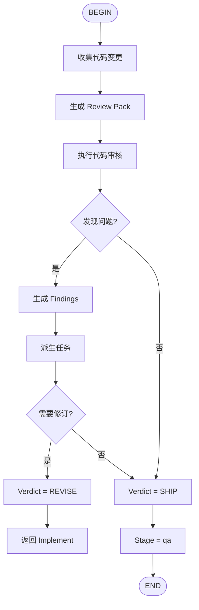

# AIDD Review Flow

执行代码审核，生成反馈。



## 输入

- `aidd/reports/loops/{ticket}/{scope_key}.loop.pack.md` - Loop Pack
- `aidd/docs/plan/{ticket}.md` - 实施计划

## 输出

- `aidd/reports/reviewer/{ticket}/{scope_key}.json` - Review Report
- 更新的 Tasklist（添加 handoff 任务）

## Verdict

- **REVISE**: 需要修改，返回 Implement 阶段
- **SHIP**: 审核通过，进入 QA 阶段

## 下一步

```
审核完成。 verdict = SHIP，下一步执行：/flow:aidd-qa-flow {ticket}
```
